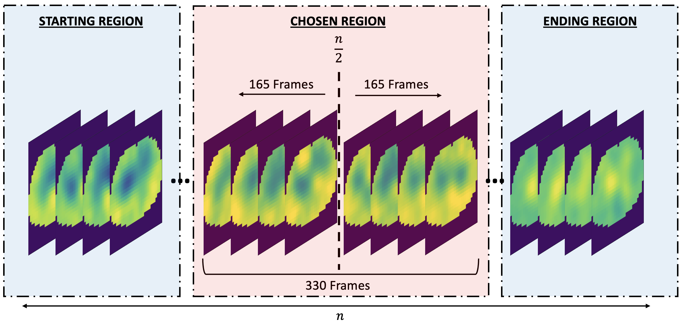
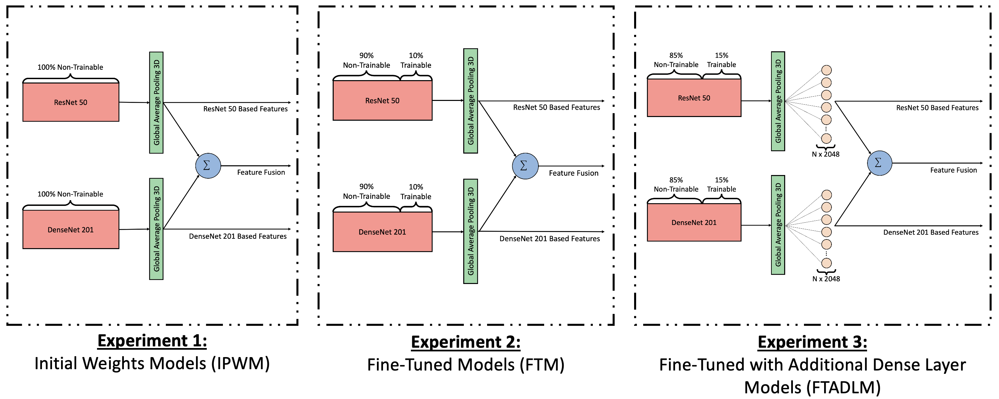
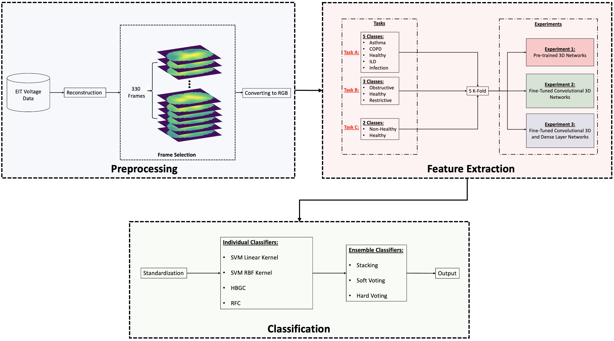

# Deep Learning-Driven Feature Engineering for Lung Disease Classification Through Electrical Impedance Tomography Imaging

## Overview

This repository hosts the implementation code used in the article titled "Deep Learning-Driven Feature Engineering for Lung Disease Classification Through Electrical Impedance Tomography Imaging". The approaches and techniques within this repository are inspired by two significant works in the field, namely:
- ["Ensemble Deep Learning Model for Dimensionless Respiratory Airflow Estimation Using Respiratory Sound"](https://github.com/DiogoMPessoa/Dimensionless-Respiratory-Airflow-Estimation.git)
- ["3D Convolutional Neural Networks for Stalled Brain Capillary Detection"](https://github.com/ZFTurbo/classification_models_3D.git)


In this project, challenges of traditional thoracic imaging—such as high costs and radiation exposure—are addressed using electrical impedance tomography (EIT), a non-invasive, radiation-free method for lung disease diagnosis. A deep learning framework is developed to classify lung diseases from EIT images, utilizing feature extraction methods from pretrained and fine-tuned models. This approach aims to simplify and improve lung diagnostics using EIT imaging.


## Requirments
```python
# python <= 3.9.7
  Tensorflow == 2.15
  classification-models-3D == 1.0.10
  Numpy
  Pandas
  Scikit-learn
```

## Repository Contents

- **ReqFunc**: Contains the necessary functions for model training. This includes code for image reconstruction and fine-tuning operations.

<p align="center">
  
</p>


- **EITExp**: Includes the model types used in the experiments, such as Initial Pretrained Weights Models (IPWM), Fine-Tuned Models (FTM), and Fine-Tuned Additional Dense Layer Models (FTADLM).
- **ModelTypes**: This folder contains the implemented code for the models used in the study, organized separately for each model type.


<p align="center">
  
</p>

- **Workflow**: Contains the main script that calls all the core functions and integrates the entire workflow of the project.

<p align="center">
  
</p>

  
## Example Usage

To run an example of how to use these models, please execute the `ExampleUsage.py` script. This script provides a simple demonstration of how to load the models, perform learnings.

## Citation

If you use this repository or the models in your work, please cite the original article titled "Deep Learning-Driven Feature Engineering for Lung Disease Classification Through Electrical Impedance Tomography Imaging" as follows:


